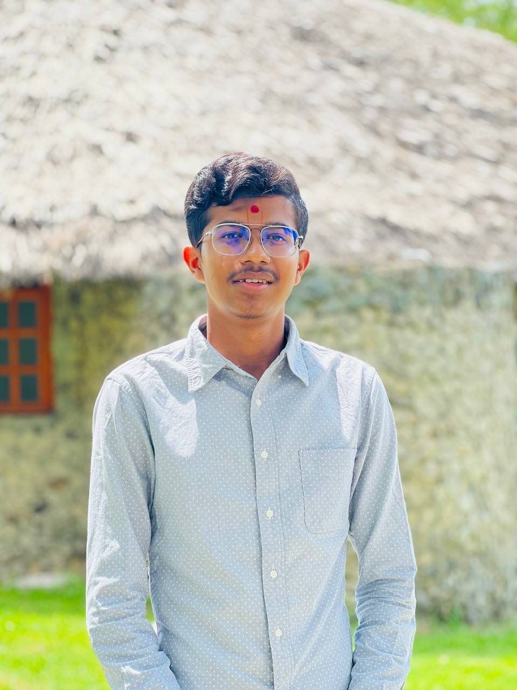
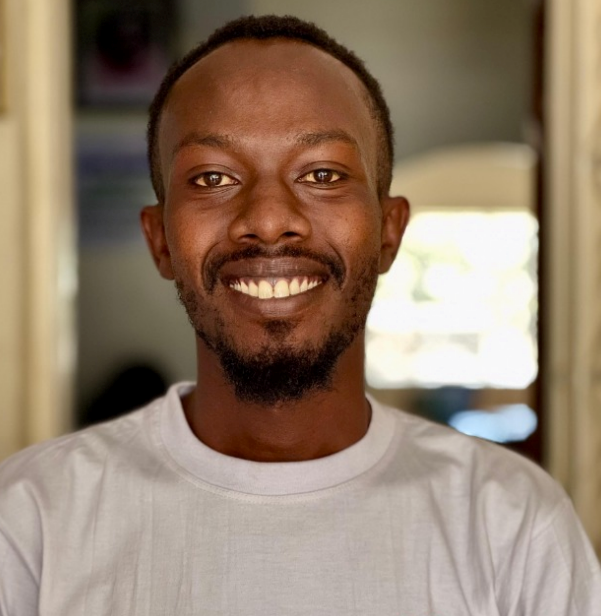
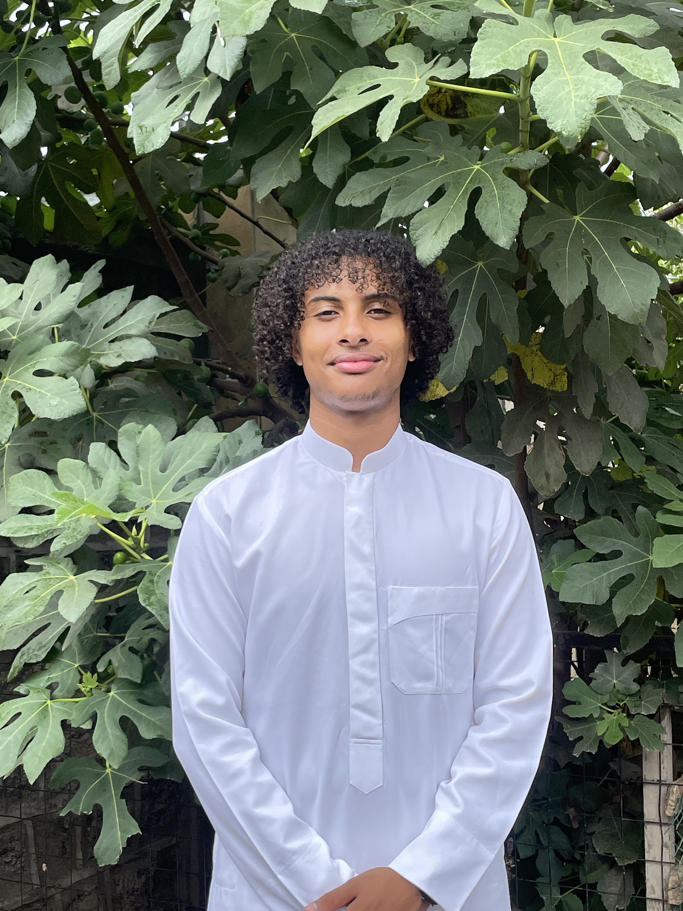
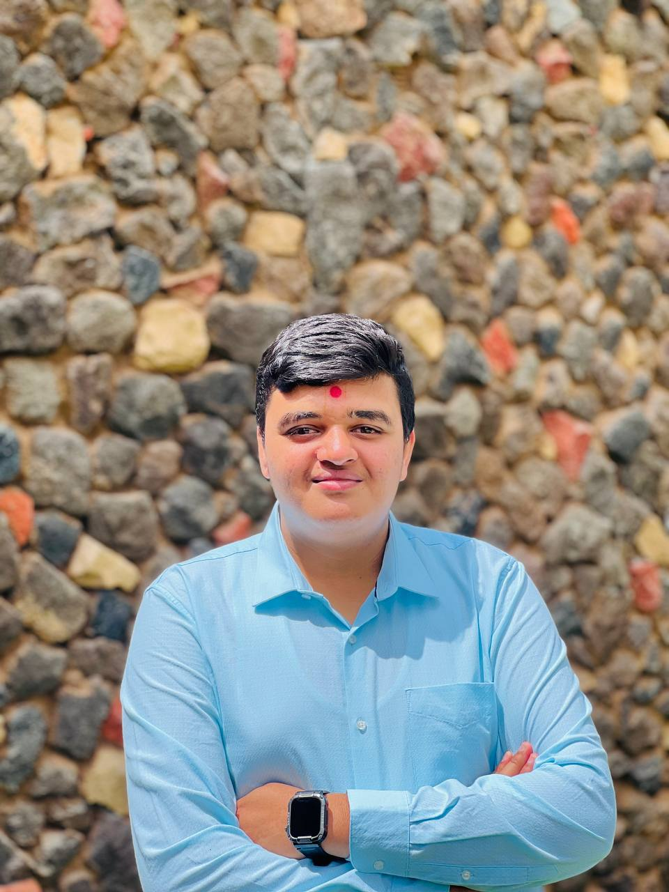
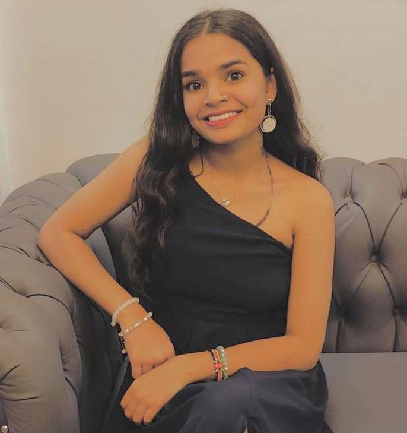

# ⚛️ April Code-Fest – React Edition

**One Day, One Project | April 1st – April 30th, 2025**  
Organized by: **[Vansh Patel](https://github.com/patel-vansh1607)**

---

## 💡 About the Code-Fest

Welcome to **April Code-Fest – React Edition**, a month-long learning and building sprint where developers challenged themselves to create **one project per day using React**.

This event is focused on enhancing core front-end development skills while promoting consistency, creativity, and collaboration.

---

## 🔧 What We Worked On

Participants worked hand-in-hand with:

- ⚛️ React.js (Functional Components & Hooks)
- 📦 State Management
- 🧩 Component-Based Design
- 🧠 Event Handling
- ✨ UI Interactions & Animation Logic

---

## 🗓️ Event Duration

**Start Date:** April 1st, 2025  
**End Date:** April 30th, 2025  
**Entry Fee:** FREE  
**Requirement:** DEDICATION ✅

---

## 👨‍💻 Organized & Coordinated by

    
     
    <strong>Vansh Patel</strong> 
    Organizer & Student
  

---
## 👨‍🏫 Mentored by

    
     
    <strong>Mr Joseph</strong> 
    Mentor
  

---
## 🤝 Contributors

  

  

    
     
    <strong>Saleh Nassor</strong> 
    Student
  

  

    
     
    <strong>Ansh Patel</strong> 
    Student
  

  

    
     
    <strong>Esha Patel</strong> 
    Student
  

---

## 📁 Projects

Each day’s project is available in its respective folder in this repository. Explore, clone, and learn!

---

## 🧠 Want to Join Next Time?

Stay connected! Keep learning. Keep building. More sprints coming soon. 🚀
"""